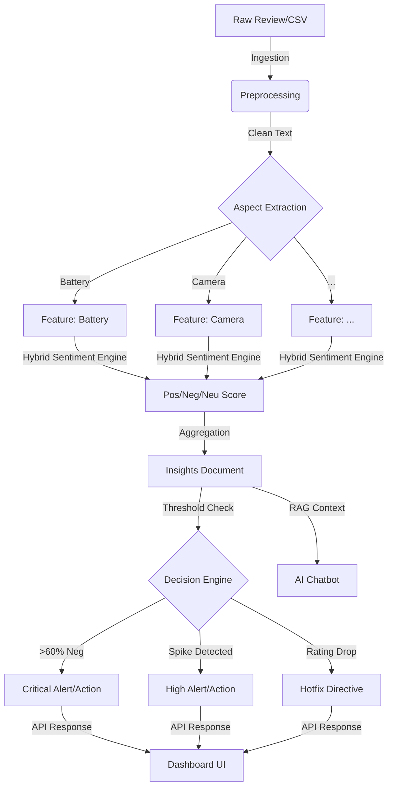

# ACVIS — Autonomous Customer Voice Intelligence System
## Full Project Summary & Technical Documentation

> **Last Updated:** April 2026  
> **Status:** Active / Production-Ready  
> **Purpose:** AI-powered review analysis platform combining NLP, sentiment intelligence, and autonomous decision-making for product companies.

---

## 📌 Table of Contents

1. [Project Overview](#1-project-overview)
2. [Tech Stack](#2-tech-stack)
3. [Architecture Overview](#3-architecture-overview)
4. [Backend — Python/FastAPI](#4-backend--pythonfastapi)
5. [Frontend — React/TypeScript](#5-frontend--reacttypescript)
6. [AI & NLP Pipeline](#6-ai--nlp-pipeline)
7. [Authentication & Security](#7-authentication--security)
8. [Database Layer](#8-database-layer)
9. [Support Ticketing System](#9-support-ticketing-system)
10. [Chatbot (Groq LLM + RAG)](#10-chatbot-groq-llm--rag)
11. [Dataset & Data Ingestion](#11-dataset--data-ingestion)
12. [Decision Engine](#12-decision-engine)
13. [Revenue Impact Modeling](#13-revenue-impact-modeling)
14. [Bug Fixes & Refinements](#14-bug-fixes--refinements)
15. [Environment Configuration](#15-environment-configuration)
16. [Deployment](#16-deployment)
17. [File Reference](#17-file-reference)
18. [System Data Flow](#18-system-data-flow)
19. [Sentiment Lexicon Details](#19-sentiment-lexicon-details)
20. [Hackathon Value Proposition](#20-hackathon-value-proposition)
21. [Future Roadmap & Limitations](#21-future-roadmap--limitations)

---

## 1. Project Overview

ACVIS (Autonomous Customer Voice Intelligence System) is a full-stack AI platform designed to:
- **Ingest** real-world product reviews from Amazon and user submissions
- **Analyze** them using a multi-stage NLP pipeline (preprocessing → aspect extraction → sentiment scoring)
- **Aggregate** insights into per-feature sentiment breakdowns, trend analysis, and emotional intelligence
- **Decide** autonomously using a Decision Engine that generates business actions and alerts
- **Serve** two distinct user portals:
  - **Company Portal**: Dashboards, analytics, AI decisions, revenue forecasting, chatbot
  - **Consumer Portal**: Submit reviews, chat with AI assistant, submit support tickets

The platform was built from scratch, migrating from a static frontend-only prototype to a fully backend-driven AI pipeline architecture.

---

## 2. Tech Stack

### Backend
| Technology | Purpose |
|---|---|
| **Python 3.11+** | Server-side language |
| **FastAPI** | REST API framework with async support |
| **Uvicorn** | ASGI server running on port `10001` |
| **MongoDB** (Atlas/Cloud) | Primary database for users, reviews, insights |
| **PyMongo** | MongoDB driver with `[srv]` Atlas support |
| **scikit-learn** | Pre-trained ML model (`sentiment_model.pkl`) for baseline sentiment |
| **joblib** | Serialization/deserialization of the ML model |
| **pandas** | Data ingestion and preprocessing |
| **Groq SDK** | LLM inference (Llama 3.1 8B Instant) for chatbot |
| **bcrypt** | Password hashing |
| **PyJWT** | JWT token generation and validation |
| **python-dotenv** | Environment variable management |
| **langdetect** | Language detection for multilingual review filtering |
| **python-multipart** | Multipart form data support (file uploads) |

### Frontend
| Technology | Purpose |
|---|---|
| **React 18** | UI framework |
| **TypeScript** | Strongly typed JavaScript |
| **Vite** | Build tool and dev server (HMR) |
| **Zustand** | Lightweight global state management |
| **React Router v6** | Client-side routing with role-based navigation |
| **Framer Motion** | Animations and micro-interactions |
| **Recharts** | Data visualization (Pie charts, Area charts, Line charts) |
| **Lucide React** | Icon library |
| **Tailwind CSS** | Utility-first styling |

### Infrastructure & Tools
| Technology | Purpose |
|---|---|
| **MongoDB Atlas** | Cloud-hosted MongoDB |
| **Render** | Deployment platform (configured via `render.yaml`) |
| **Groq API** | High-speed LLM inference (free tier) |
| **Git** | Version control |

---

## 3. Architecture Overview

```
┌─────────────────────────────────────────────────────┐
│                   ACVIS Platform                     │
├────────────────────┬────────────────────────────────┤
│   Frontend (React) │      Backend (FastAPI)          │
│   Port: 5173       │      Port: 10001                │
│                    │                                 │
│  ┌─────────────┐   │   ┌─────────────────────────┐  │
│  │Company Portal│◄──┼──►│ Auth (/register, /login) │  │
│  │  Dashboard   │   │   │ Analyze (/analyze)       │  │
│  │  Features    │   │   │ Insights (/insights)     │  │
│  │  Trends      │   │   │ Actions (/actions)       │  │
│  │  Actions     │   │   │ Alerts (/alerts)         │  │
│  │  Alerts      │   │   │ Trends (/trends)         │  │
│  │  Chatbot     │   │   │ Revenue (/revenue)       │  │
│  │  Tickets     │   │   │ Chat (/chat/company)     │  │
│  └─────────────┘   │   │ Tickets (/tickets)       │  │
│                    │   └────────────┬────────────┘  │
│  ┌─────────────┐   │                │               │
│  │ User Portal  │   │   ┌────────────▼────────────┐  │
│  │  Submit Review◄──┼──►│   AI Pipeline Engine     │  │
│  │  Chatbot     │   │   │  (nlp_engine.py)         │  │
│  │  Tickets     │   │   │                          │  │
│  └─────────────┘   │   │  1) Ingestion             │  │
│                    │   │  2) Preprocessing          │  │
│                    │   │  3) Aspect Extraction     │  │
│                    │   │  4) Hybrid Sentiment      │  │
│                    │   │  5) Emotion Detection     │  │
│                    │   │  6) Trend Aggregation     │  │
│                    │   │  7) Decision Engine       │  │
│                    │   └────────────┬────────────┘  │
│                    │                │               │
│                    │   ┌────────────▼────────────┐  │
│                    │   │      MongoDB Atlas        │  │
│                    │   │  users | reviews | insights│ │
│                    │   │  actions | tickets        │  │
│                    │   └──────────────────────────┘  │
└────────────────────┴────────────────────────────────┘
```

---

## 4. Backend — Python/FastAPI

### File Structure
```
backend/
├── main.py              # FastAPI app factory, CORS, router mount
├── routes.py            # All API endpoint definitions
├── pipeline.py          # AI pipeline orchestrator (5 stages)
├── nlp_engine.py        # Full NLP implementation (~480 lines)
├── chatbot.py           # Groq LLM chatbot with RAG context
├── database.py          # MongoDB + in-memory fallback layer
├── models.py            # Pydantic request/response models
├── auth.py              # bcrypt + JWT token logic
├── middleware.py        # JWT auth dependency guards
├── amazon_sample_generator.py  # Dataset generation script
├── refresh_dataset.py   # Manual full-pipeline re-run utility
├── sentiment_model.pkl  # Pre-trained scikit-learn ML model
├── requirements.txt     # Python dependencies
├── .env                 # Secret keys (gitignored)
├── .env.example         # Template for .env
└── seed_tickets.py      # Test data seeder for tickets
```

### Key API Endpoints

| Method | Endpoint | Auth | Description |
|---|---|---|---|
| `POST` | `/api/auth/register` | None | Create new account (company or user role) |
| `POST` | `/api/auth/login` | None | Login and receive JWT access token |
| `GET` | `/api/auth/me` | JWT | Get current user's profile |
| `POST` | `/api/analyze` | JWT | Run full AI pipeline on reviews or CSV |
| `GET` | `/api/insights` | JWT | Fetch latest aggregated insights |
| `GET` | `/api/features` | JWT | Fetch per-feature sentiment breakdown |
| `GET` | `/api/alerts` | JWT | Fetch system alerts from decision engine |
| `GET` | `/api/actions` | JWT | Fetch recommended business actions |
| `GET` | `/api/trends` | JWT | Fetch sentiment trends over time |
| `GET` | `/api/revenue` | JWT | Fetch revenue impact model |
| `GET` | `/api/stats` | JWT | Database document counts |
| `POST` | `/api/chat/user` | JWT (user) | AI chatbot for consumers |
| `POST` | `/api/chat/company` | JWT (company) | AI chatbot for company executives |
| `POST` | `/api/tickets` | JWT (user) | Submit a support ticket |
| `GET` | `/api/tickets` | JWT | List tickets (company sees all, user sees own) |
| `GET` | `/api/tickets/{id}` | JWT | Get specific ticket |
| `PATCH` | `/api/tickets/{id}/resolve` | JWT (company) | Resolve a support ticket |
| `GET` | `/api/health` | None | Liveness check |

---

## 5. Frontend — React/TypeScript

### File Structure
```
frontend-react/
├── src/
│   ├── App.tsx                  # Root router with role-based guards
│   ├── main.tsx                 # React DOM entry point
│   ├── index.css                # Global styles + Tailwind
│   ├── lib/
│   │   ├── api.ts               # Typed API client (wraps fetch)
│   │   ├── engine.ts            # Client-side NLP pipeline (TypeScript port)
│   │   ├── data.ts              # Sentiment word lists, aspect aliases, sample data
│   │   └── utils.ts             # Helper functions (capitalize, etc.)
│   ├── store/
│   │   └── appStore.ts          # Zustand global state store
│   ├── components/
│   │   ├── Chatbot.tsx          # Floating chatbot UI component
│   │   └── layout/              # Sidebar, header, layout wrappers
│   └── pages/
│       ├── auth/                # Login, Register pages
│       ├── company/
│       │   ├── Overview.tsx     # KPIs, feature health bars, alerts
│       │   ├── Features.tsx     # Feature sentiment table + donut charts
│       │   ├── Trends.tsx       # Time-series trend visualization
│       │   ├── Actions.tsx      # Recommended business actions
│       │   ├── Alerts.tsx       # System alerts dashboard
│       │   ├── Analyze.tsx      # Review ingestion UI (CSV or manual)
│       │   ├── Reports.tsx      # Full downloadable analytics report
│       │   ├── Settings.tsx     # Account settings
│       │   └── Tickets.tsx      # Support ticket management (company view)
│       └── user/
│           └── Tickets.tsx      # Submit & track tickets (user view)
├── vite.config.ts               # Dev server + API proxy to :10001
└── package.json
```

### State Management (Zustand)

The `appStore.ts` manages the following global state slices:

| Slice | Type | Description |
|---|---|---|
| `rawReviews` | `Review[]` | Ingested review objects |
| `featureSentiment` | `Record<string, FeatureStats>` | Per-feature pos/neg/neutral ratios |
| `trends` | `Record<>` | Daily sentiment time-series |
| `trendAlerts` | `Record<>` | Spike detection results |
| `rootCauses` | `Record<>` | Root cause keyword frequencies |
| `emotions` | `Record<>` | Aggregated emotion counts |
| `predictions` | `object` | Rating trajectory (current → predicted) |
| `actions` | `Action[]` | Business recommendations |
| `alerts` | `Alert[]` | System alerts |
| `revenueImpact` | `object` | Revenue model (loss, churn, exposure) |
| `isProcessing` | `boolean` | Pipeline processing state |
| `backendConnected` | `boolean` | Backend connectivity flag |

---

## 6. AI & NLP Pipeline

The pipeline runs across 5 ordered stages, coordinated by `pipeline.py` and implemented in `nlp_engine.py`.

### Stage 1: Ingestion (`ingest_reviews`)
- Deduplicates reviews by hashing clean text using `hashlib`
- Normalises `review_id`, timestamp (epoch → ISO-8601), and source field
- Skips blank reviews and reviews under minimum length

### Stage 2: Preprocessing (`preprocess_all`)
- **Lowercasing** and HTML stripping
- **Contraction expansion**: e.g., `"won't"` → `"will not"`
- **Slang normalisation**: e.g., `"tbh"` → `"to be honest"`
- **Punctuation cleaning** while retaining word boundaries
- **Language detection** using `langdetect` (non-English reviews handled gracefully)

### Stage 3: NLP Analysis (`analyze_all`)
Runs per-review:

#### Aspect Extraction (`extract_aspects`)
- Matches review text against **16 product feature categories**: `battery`, `camera`, `ui`, `performance`, `display`, `audio`, `storage`, `connectivity`, `durability`, `software`, `price`, `support`, `heating`, `fingerprint`, `delivery`, `general`
- Uses keyword alias dictionaries (`ASPECT_ALIASES`) — e.g., `battery` triggers on `"charging"`, `"drain"`, `"mah"`, `"backup"`, etc.
- Falls back to `general` if no specific feature is identified

#### Hybrid Sentiment Engine (`score_sentiment`)
A **3-tier priority system** designed to override the biased ML model:

**Tier 1 — Numerical Rating (Highest Priority)**
- `rating >= 4` → `positive`
- `rating <= 2` → `negative`
- `rating == 3` → falls to text analysis

**Tier 2 — Strict Negative Keyword Override**
Hard negative overrides that bypass all other logic:
> `worst`, `terrible`, `horrible`, `awful`, `trash`, `garbage`, `pathetic`, `disgusting`, `useless`, `waste`, `broken`, `dead`, `scam`, `avoid`, `fraud`, `unusable`, `fails`

**Tier 3 — Keyword Scoring with Sarcasm Detection**
- Strips punctuation from words before matching (fixes the `"bad!"` bug)
- Scores positive/negative word density with 1.5× weighting
- Detects sarcasm patterns (e.g., `"Great, another crash"`) and inverts scores

**Tier 4 — ML Model Fallback (Lowest Priority)**
- Uses `sentiment_model.pkl` (scikit-learn TF-IDF + classifier) when no keyword signals are found
- Model was identified as positively biased; used only as a last resort

#### Emotion Detection (`detect_emotion`)
Classifies each review into: `anger`, `frustration`, `satisfaction`, or `neutral`

#### Keyword Extraction (`extract_keywords`)
- Removes stopwords and common aspect/sentiment words
- Extracts top 5 meaningful content words per review

### Stage 4: Insights Aggregation
- **`aggregate_feature_sentiment`**: Per-feature positive/negative/neutral ratios across all reviews
- **`aggregate_trends`**: Daily time-series of sentiment counts per feature
- **`detect_spikes`**: Identifies sudden negative complaint spikes (≥ 2× moving average threshold)
- **`identify_root_causes`**: Correlates root cause keywords (`"update"`, `"patch"`, `"v2"`, `"after"`) with negative features
- **`aggregate_emotions`**: Batch emotion counts
- **`compute_predictions`**: Linear rating trajectory using first-half vs second-half average (slope → `declining` / `improving` / `stable`)

### Stage 5: Decision Engine (`generate_decisions`)
Generates prioritised business actions and alerts:

| Priority | Trigger |
|---|---|
| `critical` | Feature negative sentiment > 60% |
| `high` | Spike detected, overall rating declining, support satisfaction critically low |
| `medium` | Feature negative sentiment 30–60% |
| `low` | Feature with > 70% positive and significant volume (leverage for marketing) |

---

## 7. Authentication & Security

- **Registration**: Passwords hashed with `bcrypt` before storage
- **Login**: Returns a signed **JWT Bearer token** (HS256)
  - Token payload contains: `{sub: email, role: "company"|"user"}`
  - Token expiry: configurable via `ACCESS_TOKEN_EXPIRE_MINUTES`
- **Route Guards**:
  - `get_current_user`: Validates JWT, required on all protected routes
  - `require_company`: Only allows `role == "company"` — used for ticket resolution, company chatbot
  - `require_user`: Only allows `role == "user"` — used for submitting tickets, consumer chatbot
- **Frontend**: JWT stored in `localStorage` under `acvis-auth-storage` (Zustand persist)
- **CORS**: Configured in `main.py` to allow all local dev origins (ports 5173–5175, 3000, 8000)

---

## 8. Database Layer

### MongoDB Collections
| Collection | Contents |
|---|---|
| `users` | Email, hashed password, role |
| `raw_reviews` | Ingested review JSON objects |
| `processed_reviews` | Cleaned text, expanded contractions, timestamps |
| `ai_outputs` | Per-review aspect, sentiment, emotion, keywords |
| `insights` | Aggregated feature sentiment, trends, predictions |
| `actions` | Decision engine outputs: actions + alerts + revenue |
| `tickets` | Support ticket records with lifecycle tracking |

### In-Memory Fallback (`database.py`)
When MongoDB is unavailable (e.g., missing `.env`), the system gracefully degrades to an **in-memory database** using Python dictionaries. Key features:
- `InMemoryCollection` class mimics PyMongo's `find()`, `find_one()`, `insert_one()`, `update_one()`, `delete_many()`, `count_documents()`
- `InMemoryCursor` class implements chainable `.sort()` to exactly match PyMongo cursor behavior (fixed 502 errors in the Tickets route)
- Transparent fallback — routes work identically regardless of database backend

### Connection Logic
```python
# Attempts Atlas connection first; falls back silently on failure
MONGO_URI = os.getenv("MONGO_URI")
if MONGO_URI:
    client = MongoClient(MONGO_URI, serverSelectionTimeoutMS=5000)
    # ... connect and print [OK]
else:
    # Fall back to in-memory collections
```

---

## 9. Support Ticketing System

A complete end-to-end customer support ticketing module was implemented:

### Ticket Lifecycle
```
User submits ticket → status: "open"
Company views ticket in admin panel
Company resolves with a note → status: "resolved"
```

### Ticket Schema
```typescript
{
  ticket_id: string       // e.g., "TKT-A3F7B2C1"
  subject: string
  description: string
  category: string        // e.g., "billing", "technical", "shipping"
  status: "open" | "resolved"
  user_email: string
  created_at: ISO timestamp
  resolved_at: ISO timestamp | null
  resolution_note: string | null
}
```

### Role-Based Access
- **Users** can only see their own tickets
- **Company** users see all tickets with full resolution controls
- The `require_user` middleware enforces ticket creation permissions
- The `require_company` middleware enforces resolution permissions

### Frontend Pages
- **`/company/tickets`** — Full ticket management dashboard with status filters, search, and one-click resolution modal
- **`/user/tickets`** — Consumer interface to submit tickets with category selection and track status

---

## 10. Chatbot (Groq LLM + RAG)

A role-aware AI chatbot powered by **Llama 3.1 8B Instant** via the Groq API with retrieval-augmented generation (RAG).

### Architecture
Two separate chatbot contexts:

**Consumer Chatbot (`/api/chat/user`)**
- System prompt instructs the model to behave as a helpful product assistant
- Context: pulls up to 20 recent processed reviews from MongoDB
- The model can answer questions like "Is the battery good?" based on real user reviews

**Company Chatbot (`/api/chat/company`)**
- System prompt instructs the model to behave as an expert AI business analyst
- Context: injects full live analytics — feature sentiment ratios, predictions, top alerts, revenue exposure
- Can answer questions like "What should we fix first?" or "How much are we losing?"

### Key Settings
```python
model = "llama-3.1-8b-instant"
temperature = 0.3     # Low temperature for factual, consistent responses
max_tokens = 600      # Concise business-focused answers
```

### Graceful Degradation
- If `GROQ_API_KEY` is not set, returns a clear offline message instead of crashing

---

## 11. Dataset & Data Ingestion

### Primary Dataset
**Amazon Reviews 2023** (HuggingFace) — Consumer electronics reviews
- Format: JSON array stored in `amazon_reviews_sample.json`
- Size: 500 reviews
- Ratings distribution: 1★ (159), 2★, 3★, 4★, 5★ across all rating levels
- Fields: `text`, `rating` (float), `user_id`, `timestamp` (epoch ms)

### Dataset Schema Conversion
The loader (`_load_amazon_reviews`) converts HuggingFace schema to ACVIS format:
```python
# HuggingFace → ACVIS
{
  "user_id": "...",          # → review_id
  "text": "...",             # → text
  "rating": 4.0,             # → rating (float)
  "timestamp": 1617235200000 # → ISO-8601 datetime string
}
```

### Fallback Dataset
If the JSON is unavailable, the system falls back to `7817_1.csv` (Kaggle Amazon dataset):
```
reviews.text | reviews.rating | reviews.date | id
```

### Data Refresh Script
`backend/refresh_dataset.py`:
- Loads 500 reviews from the JSON
- Runs the full pipeline end-to-end
- Saves results to MongoDB
- Prints a summary table of feature sentiment ratios

---

## 12. Decision Engine

The Decision Engine (implemented in both `nlp_engine.py` and `engine.ts`) generates structured business intelligence:

### Alert Thresholds
| Condition | Alert Priority |
|---|---|
| Feature negative > 60% | `critical` |
| Spike detected (≥2× avg) | `high` |
| Overall rating declining | `high` |
| Support satisfaction negative > 40% | `high` |
| Feature negative 30–60% | `medium` (action only) |
| Feature positive > 70% + high volume | `low` (opportunity) |

### Risk Velocity
- Calculates the rate of change in negative sentiment between the two most recent measurement periods
- Used to detect rapidly worsening issues

### Autonomous Directives
High-level executive-facing commands generated by the system:
- `CRITICAL` — e.g., "Rollback Update v2.1 Immediately"
- `ADVISORY` — e.g., "Pivot Engineering to Bug-Fix Sprint"
- `GROWTH` — e.g., "Launch Marketing Campaign for Camera"

---

## 13. Revenue Impact Modeling

The revenue impact calculator (`calculate_revenue_impact`) models business exposure:

### Configuration
```python
total_users = 5,000,000        # Platform user base
arpu_monthly = ₹149            # Average revenue per user per month
churn_per_rating_drop = 8%     # Churn increase per 1-star rating drop
spike_threshold = 2.0          # Spike detection sensitivity
currency_multiplier = 10,000,000  # For Crore (₹Cr) formatting
```

### Calculations
- **Monthly Revenue Loss** = `users × arpu × churn_increase_(%)`
- **Churn Increase** = `rating_delta × churn_per_rating_drop`
- **Top Liability Feature** = Feature with highest `negative_rate × volume × spike_multiplier`
- **Liability Exposure** = `monthly_loss × 0.6` (if top liability exists)

---

## 14. Bug Fixes & Refinements

A significant portion of development was spent debugging and refining initial bugs:

### 14.1 — **502 Bad Gateway on Login/Register** (Fixed)
- **Root Cause**: Vite proxy in `vite.config.ts` was targeting port `8000`; backend runs on `10001`
- **Fix**: Updated proxy target to `http://127.0.0.1:10001`

### 14.2 — **502 Bad Gateway on Tickets API** (Fixed)
- **Root Cause**: The `InMemoryCollection.find()` returned a plain Python list; the route was calling `.sort()` on it (PyMongo cursor method — not available on lists)
- **Fix**: Created `InMemoryCursor` class that wraps the list and supports fluent `.sort()` chaining

### 14.3 — **Only Positive Sentiment Displayed** (Root Cause: Multi-layer)
The most complex bug, caused by three separate issues:

**Layer 1 — ML Model Bias (Backend)**
- The pre-trained `sentiment_model.pkl` was biased toward "positive" due to training data imbalance
- **Fix**: Implemented the Hybrid Sentiment Engine with rating-first, strict-keyword-second logic, relegating ML to last-resort fallback

**Layer 2 — Punctuation Bug (Backend)**
- Words like `"bad!"` were not matching the negative word dictionary because punctuation wasn't stripped before matching
- **Fix**: Added `re.sub(r"[.,!?-]", "", word)` preprocessing before dictionary lookups

**Layer 3 — Wrong Proxy Port (Frontend)**
- Even after fixing the backend, the frontend proxy reverted to port `8000`, silently falling back to client-side NLP which had the same bias bugs
- **Fix**: Corrected Vite proxy target again — permanent fix applied

**Layer 4 — Client-Side NLP Engine Not Updated (Frontend)**
- The TypeScript `engine.ts` client fallback also lacked rating-based prioritization and the punctuation fix
- **Fix**: Implemented identical Hybrid Sentiment Engine in TypeScript with rating priority and punctuation stripping

### 14.4 — **Stale Database Insights** (Fixed)
- After code fixes, the existing MongoDB insights document still contained the old biased data
- **Fix**: Built and ran `refresh_dataset.py` to re-process 500 reviews and update all MongoDB collections

### 14.5 — **Fake Review Detection Removed** (Refactored)
- An initial fake review detection system was implemented but proved too aggressive (blocking real negative reviews)
- After multiple iterations of loosening, the user requested full removal
- **Fix**: Completely removed `detect_fake_reviews()`, related model fields, pipeline filtering, and all tests

---

## 15. Environment Configuration

### `backend/.env`
```env
MONGO_URI=mongodb+srv://<user>:<password>@cluster0.mongodb.net/acvis
GROQ_API_KEY=gsk_...
```

### `backend/.gitignore`
```
.env
__pycache__/
*.pkl
```

### `frontend-react/vite.config.ts`
```typescript
server: {
  proxy: {
    '/api': {
      target: 'http://127.0.0.1:10001',
      changeOrigin: true,
      secure: false,
    }
  }
}
```

---

## 16. Deployment

Deployment is configured via `render.yaml` for the **Render** platform:

```yaml
services:
  - type: web
    name: acvis-backend
    env: python
    buildCommand: pip install -r requirements.txt
    startCommand: uvicorn main:app --host 0.0.0.0 --port 10001
    envVars:
      - key: MONGO_URI
        sync: false
      - key: GROQ_API_KEY
        sync: false

  - type: static
    name: acvis-frontend
    buildCommand: npm run build
    staticPublishPath: ./dist
```

### Running Locally
```bash
# Backend
cd backend
pip install -r requirements.txt
uvicorn main:app --port 10001 --reload

# Refresh dataset (first time)
python refresh_dataset.py

# Frontend
cd frontend-react
npm install
npm run dev
```

---

## 17. File Reference

### Backend Files
| File | Lines | Description |
|---|---|---|
| `main.py` | 45 | FastAPI app, CORS middleware |
| `routes.py` | 280 | All API routes |
| `pipeline.py` | ~160 | 5-stage pipeline orchestrator |
| `nlp_engine.py` | 480 | Complete NLP implementation |
| `chatbot.py` | 89 | Groq LLM chatbot + RAG context builders |
| `database.py` | ~170 | MongoDB + in-memory fallback |
| `models.py` | ~90 | Pydantic models |
| `auth.py` | ~50 | bcrypt + JWT logic |
| `middleware.py` | ~40 | JWT guards |
| `amazon_sample_generator.py` | ~180 | Dataset generator |
| `refresh_dataset.py` | ~60 | Manual pipeline runner |
| `test_robustness.py` | ~45 | Sentiment accuracy tests |

### Frontend Files
| File | Description |
|---|---|
| `src/lib/api.ts` | Typed API client with JWT injection |
| `src/lib/engine.ts` | TypeScript NLP engine (client fallback) |
| `src/lib/data.ts` | Word lists, aliases, types, sample data |
| `src/store/appStore.ts` | Zustand global state + async actions |
| `src/pages/company/Overview.tsx` | KPI cards, feature health, alert panel |
| `src/pages/company/Features.tsx` | Sentiment table + donut charts |
| `src/pages/company/Trends.tsx` | Time-series trend charts |
| `src/pages/company/Analyze.tsx` | Review ingestion & pipeline trigger UI |
| `src/pages/company/Actions.tsx` | Business action recommendations |
| `src/pages/company/Alerts.tsx` | System alert dashboard |
| `src/pages/company/Reports.tsx` | Comprehensive downloadable report |
| `src/pages/company/Tickets.tsx` | Company ticket management |
| `src/components/Chatbot.tsx` | Floating chat window component |
| `vite.config.ts` | Build config + dev proxy |

---

## Summary of Major Milestones

| # | Milestone | Status |
|---|---|---|
| 1 | Auth system (register/login/JWT/RBAC) | ✅ Complete |
| 2 | Backend FastAPI + MongoDB integration | ✅ Complete |
| 3 | AI Pipeline (5-stage NLP) | ✅ Complete |
| 4 | Frontend React + Zustand store | ✅ Complete |
| 5 | CSV/JSON dataset ingestion | ✅ Complete |
| 6 | Decision Engine + Revenue Modeling | ✅ Complete |
| 7 | Groq Chatbot with dual RAG contexts | ✅ Complete |
| 8 | Support Ticketing System | ✅ Complete |
| 9 | In-memory DB fallback | ✅ Complete |
| 10 | Hybrid Sentiment Engine (bias fix) | ✅ Complete |
| 11 | Sentiment punctuation handling | ✅ Complete |
| 12 | Client-side NLP parity with backend | ✅ Complete |
| 13 | Fake review detection (removed) | ❌ Removed by request |
| 14 | Full dataset refresh tooling | ✅ Complete |
| 15 | Deployment config (Render) | ✅ Configured |

---

## 18. System Data Flow

The following diagram illustrates how a raw review travels from ingestion to becoming an autonomous business directive:



---

## 19. Sentiment Lexicon Details

To maintain high accuracy without expensive LLM calls for every review, ACVIS uses a curated lexicon and pattern-matching system.

### 19.1 Strict Negative Overrides (`NEG_STRICT`)
These words trigger an immediate `negative` classification, bypassing the ML model entirely:
`worst`, `terrible`, `horrible`, `awful`, `trash`, `garbage`, `pathetic`, `disgusting`, `useless`, `waste`, `broken`, `dead`, `scam`, `avoid`, `fraud`, `unusable`, `fails`

### 19.2 Punctuation Robustness
A critical fix was implemented to ensure that emphatic feedback is not lost. The engine now cleans punctuation specifically for dictionary matching:
- **Input:** `"The battery is garbage!"`
- **Processing:** `garbage!` → `garbage`
- **Match:** `garbage` ∈ `NEG_STRICT`
- **Result:** `Negative`

### 19.3 Sarcasm Patterns
The engine uses regex to detect sarcasm and invert the sentiment:
- `great` + `crash/lag/fail` → **Negative**
- `amazing` + `slow/bug/drain` → **Negative**
- `perfect` + `freeze/broke` → **Negative**

---

## 20. Hackathon Value Proposition

ACVIS was designed as a **Decision Intelligence Platform**, moving beyond simple "charts and graphs."

### 20.1 The Price of Inaction
Unlike standard analytics tools, ACVIS quantifies the financial risk. It calculates the **Monthly Revenue Loss Exposure** based on churn probability relative to rating drops. This allows executives to see exactly how much a specific bug (e.g., a "Battery Spike") is costing the company in real-time.

### 20.2 The Autonomous Product Manager
The "AI Command Center" provides **Directives**, not just data.
- **Example:** If a major regression is detected after a firmware update, ACVIS issues a `CRITICAL` directive: *"Rollback Update v2.1 Immediately; detected catastrophic rating drop linked to Battery regressions."*

### 20.3 Multi-Persona AI Chatbot
- **For Customers:** An assistant that helps them explore product capabilities based on other users' real experiences.
- **For Executives:** A RAG-powered analyst that can answer complex queries like *"What feature is hurting our revenue most this week?"* using live database context.

---

## 21. Future Roadmap & Limitations

### 21.1 Known Limitations
- **ML Bias:** The fallback ML model can sometimes lean positive; the current Hybrid logic mitigates this but a full retrain on a balanced dataset is recommended for production.
- **Vector Search:** The current RAG implementation uses a limit-based retrieval; future versions will implement Vector Embeddings (e.g., Pinecone or ChromaDB) for more precise context.

### 21.2 Upcoming Features
- **What-If Simulations:** A slider to project future ratings: *"If we improve 'UI' sentiment by 20%, what is our projected ARPU in 3 months?"*
- **Competitor Benchmarking:** Direct side-by-side ingestion of competitor reviews to identify market-winning features.
- **Predictive Risk Radar:** Analyzing "sentiment velocity" to predict spikes before they trigger critical alerts.

---

**End of Documentation**
